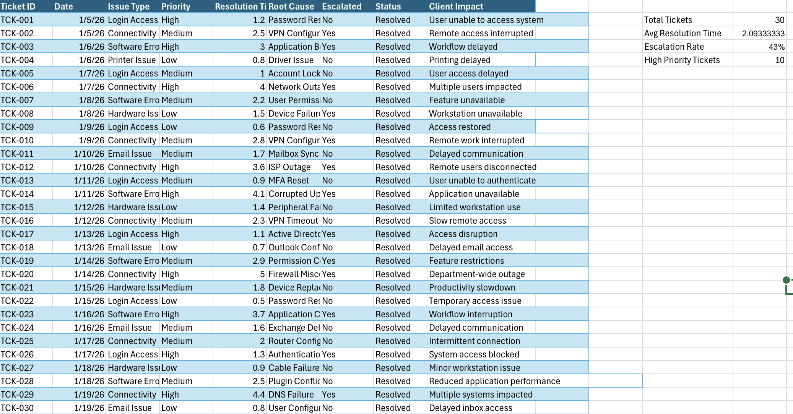
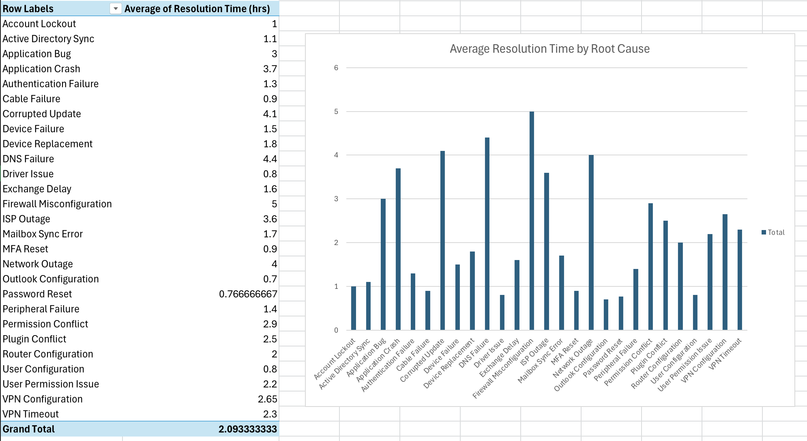
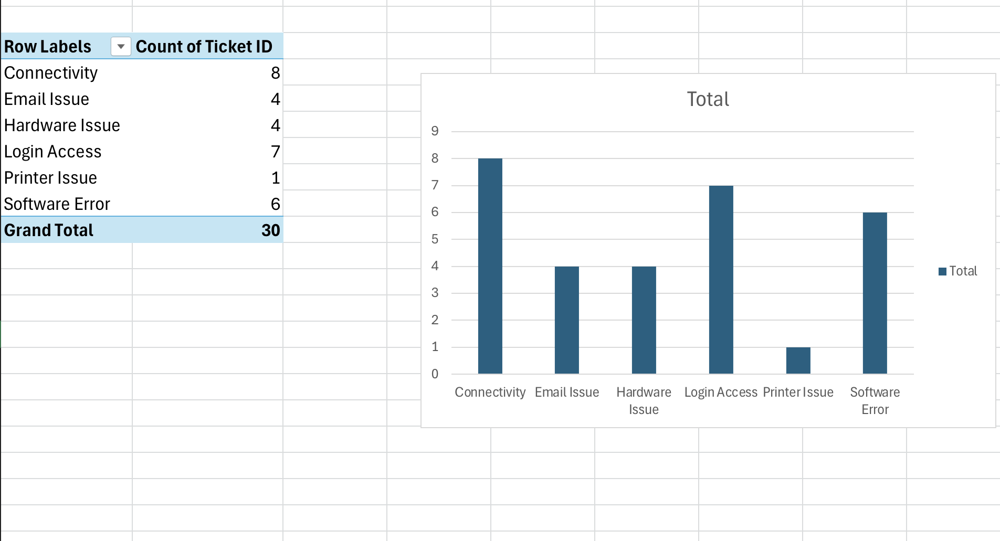

# Technical Support Root Cause Analysis Dashboard

## Project Overview
Developed an Excel-based technical support dashboard to analyze ticket trends, escalation patterns, root causes, and resolution performance within a simulated IT support environment.

## Tools Used
- Microsoft Excel
- Pivot Tables
- KPI Reporting
- Data Visualization

## Key Metrics
- Tracked ticket volume across multiple issue categories
- Measured average resolution time by root cause
- Analyzed escalation rates and high-priority ticket trends
- Identified recurring support issues impacting operational efficiency

## Project Objectives
- Analyze technical support workflow performance
- Identify recurring root causes and escalation trends
- Support data-driven troubleshooting and reporting
- Improve visibility into operational support metrics

## Dashboard Preview

### Dashboard Overview

### Pivot Table Analysis

## Skills Demonstrated
- Root Cause Analysis
- Technical Troubleshooting
- Workflow Analysis
- KPI Reporting
- Operational Reporting
- Data Analysis
- Client Support
- Process Improvement
